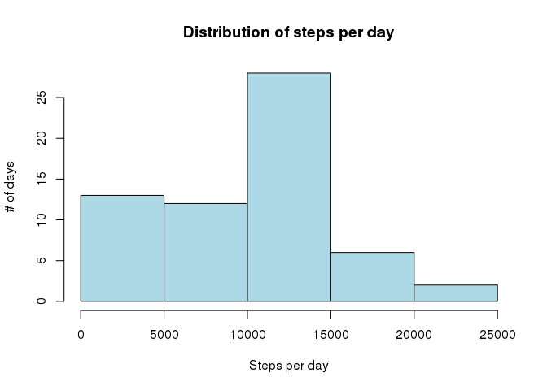
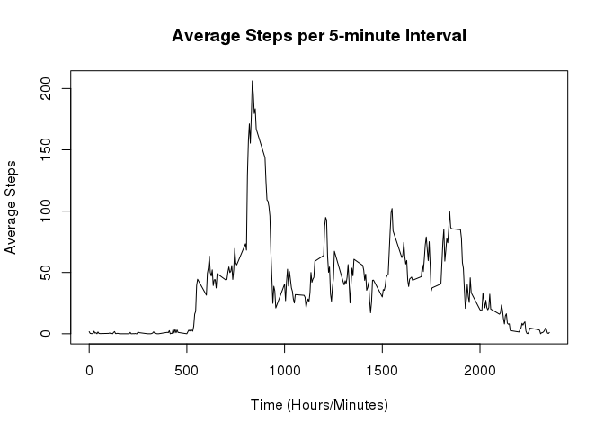
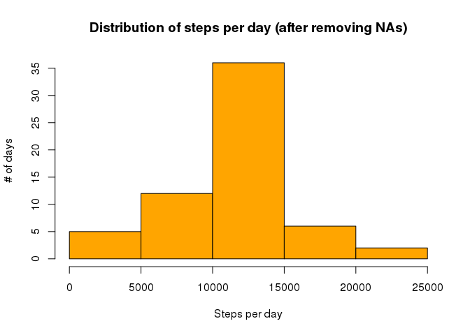
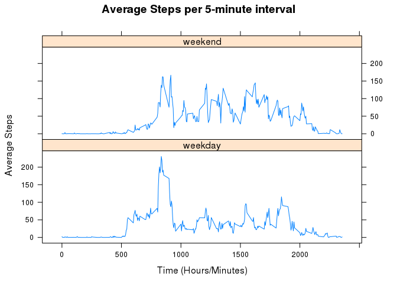

# Reproducible Research: Peer Assessment 1

In this peer assessment, the attendants of the Reproducible Research course shall extract, from a given dataset (contained at file *activity.zip* in this GitHub repository) some useful analysis to aid people who collect fitness related data with some types of devices. 

In the following sections, the steps for loading and processing the data in the dataset will be described, and the results of the analysis exposed. 


## Loading and preprocessing the data

Firstly, the dataset must be unzipped and loaded into a data frame. **Here it is assumed that the working directory is set to the root of this GitHub repository**. This step can be fullfiled by the following code chunk: 


```r
Sys.setlocale("LC_TIME", "C")
```

```
## [1] "C"
```

```r
#unzip("activity.zip")
DF <- read.csv("activity.csv")
summary(DF)
```

```
##      steps                date          interval     
##  Min.   :  0.00   2012-10-01:  288   Min.   :   0.0  
##  1st Qu.:  0.00   2012-10-02:  288   1st Qu.: 588.8  
##  Median :  0.00   2012-10-03:  288   Median :1177.5  
##  Mean   : 37.38   2012-10-04:  288   Mean   :1177.5  
##  3rd Qu.: 12.00   2012-10-05:  288   3rd Qu.:1766.2  
##  Max.   :806.00   2012-10-06:  288   Max.   :2355.0  
##  NA's   :2304     (Other)   :15840
```

This data frame contains three columns, *steps*, *date* and *interval*, and about 17570 observations with missing values. **Interval** corresponds to the hour/minute of the day when the measurement was taken. The device collected measures every 5 minutes. **Date** ranges from *01-Oct-2012* to *30-Nov-2012*. 


## What is mean total number of steps taken per day?

The data set consists of individual measures collected in 5-minute intervals. This information is too granular for the analysis. **Better than that, we can look for daily patterns**. In this section of the analysis, it is presented the distribution of total steps taken per day as a *histogram*. From this, we can make assumptions about the walking profile of this subject. And to complete the daily analysis, the steps mean and median is calculated. 


With the *aggregate* function, it is calculated the sum of steps per day. In this phase, the missing values will be ignored.


```r
attach(DF)
dailySumDF <- aggregate(DF$steps, list(date), sum, na.rm=TRUE)
detach(DF)
names(dailySumDF) <- c("date", "steps")
head(dailySumDF)
```

```
##         date steps
## 1 2012-10-01     0
## 2 2012-10-02   126
## 3 2012-10-03 11352
## 4 2012-10-04 12116
## 5 2012-10-05 13294
## 6 2012-10-06 15420
```


The following histogram shows the distribution of total steps per day. From here it is possible to conclude that this subject walks 10k to 15k steps per day.


```r
hist(dailySumDF$steps, xlab = "Steps per day", ylab = "# of days", col = "light blue", main = "Distribution of steps per day")
```

<!-- -->


From the histogram, we expect that the mean and median are located close to 10k steps per day. The actual values are: 


```r
mean(dailySumDF$steps)
```

```
## [1] 9354.23
```

```r
median(dailySumDF$steps)
```

```
## [1] 10395
```


## What is the average daily activity pattern?

The previous section provided a quantitative measure: it is now possible to know about the volume of steps per day. But knowing that this subject walks 9k-10k steps per day does not give enough information about the average distribution of them within a day. We need some measure which is more qualitative. So in this section we look at the measures from another dimension: **average steps per interval of the day**.


With the *aggregate* function, it is calculated the mean steps per time interval. In this phase, the missing values are still being ignored.


```r
attach(DF)
intervalMeanDF <- aggregate(DF$steps, list(interval), mean, na.rm=TRUE)
detach(DF)
names(intervalMeanDF) <- c("interval", "steps")
head(intervalMeanDF)
```

```
##   interval     steps
## 1        0 1.7169811
## 2        5 0.3396226
## 3       10 0.1320755
## 4       15 0.1509434
## 5       20 0.0754717
## 6       25 2.0943396
```


The following plot shows a time series of average steps as the 5-minute intervals pass within a day. From here it is possible to conclude that this subject:

* Does not usually walk from midnight to 5am;
* Usually walks from 30-100 steps per 5-minute interval during most of the day;
* Has a peak of usual walking activity around 8am and 9am; 
* Decreases his activity from 8pm to midnight. 


```r
plot(intervalMeanDF$interval, intervalMeanDF$steps, type = "l", xlab = "Time (Hours/Minutes)", ylab = "Average Steps", main = "Average Steps per 5-minute Interval")
```

<!-- -->


This suggests that this subject makes sport in the morning, with a peak of around 200 steps. **In fact, the next calculation shows that the peak occurs at 8:35am, when he walks an average of 206.1698 steps**. 


```r
intervalMeanDF[which.max(intervalMeanDF$steps), ]
```

```
##     interval    steps
## 104      835 206.1698
```


## Imputing missing values

The high amount of missing values within this dataset might cause some bias on the analysis. In this section, we are imputing data within the data frame, *which was not collected by the device, but is somehow connected to other data collected*. The proposed strategy here is to use **the mean amount of steps per time interval**, to fulfill NAs with data. Considering the structure of the measures, it seems to be the one that adds least noise to the real data. 


Recovering previous analysis, the number of rows with missing values is: 


```r
sum(is.na(DF))
```

```
## [1] 2304
```


The following code chunk copies the original data frame, and makes the attribution of data, replacing NAs with the mean for that time interval. 


```r
noNaDF <- DF
for (i in 1:nrow(noNaDF)) {
    if (is.na(noNaDF[i,1])) {
        noNaDF[i,1] <- intervalMeanDF[intervalMeanDF[,1] == noNaDF[i,3], 2]
    }
}
```


To compare the effects of those attributions, the calculations from the first section (*What is mean total number of steps taken per day?*) are repeated, to check how much noise they caused. 


```r
attach(noNaDF)
dailySumNoNaDF <- aggregate(noNaDF$steps, list(date), sum, na.rm=TRUE)
detach(noNaDF)
names(dailySumNoNaDF) <- c("date", "steps")
head(dailySumNoNaDF)
```

```
##         date    steps
## 1 2012-10-01 10766.19
## 2 2012-10-02   126.00
## 3 2012-10-03 11352.00
## 4 2012-10-04 12116.00
## 5 2012-10-05 13294.00
## 6 2012-10-06 15420.00
```

```r
hist(dailySumNoNaDF$steps, xlab = "Steps per day", ylab = "# of days", col = "orange", main = "Distribution of steps per day (after removing NAs)")
```

<!-- -->

```r
mean(dailySumNoNaDF$steps)
```

```
## [1] 10766.19
```

```r
median(dailySumNoNaDF$steps)
```

```
## [1] 10766.19
```


From the above results, it is possible to notice: 

1. The histogram now behaves more like a normal distribution; 
1. The mean and median now have the same value;
1. The value of the mean/median are closer to the previous value for the median.


## Are there differences in activity patterns between weekdays and weekends?

If we consider the weekday/weekend routines, normally the daily activities of a subject is not the same. For diferentiating the activity patterns between weekdays and weekends, we will need to categorize the dates within those two categories. This is done by *cbind*ing a new column to the data frame without NAs.


```r
noNaDF <- cbind(noNaDF, factor(ifelse(weekdays(as.Date(noNaDF$date)) == "Saturday" | weekdays(as.Date(noNaDF$date)) == "Sunday", "weekend", "weekday")))
names(noNaDF) <- c("steps", "date", "interval", "typeOfDay")
head(noNaDF)
```

```
##       steps       date interval typeOfDay
## 1 1.7169811 2012-10-01        0   weekday
## 2 0.3396226 2012-10-01        5   weekday
## 3 0.1320755 2012-10-01       10   weekday
## 4 0.1509434 2012-10-01       15   weekday
## 5 0.0754717 2012-10-01       20   weekday
## 6 2.0943396 2012-10-01       25   weekday
```


To compare weekday/weekend daily activity patterns, the calculations from the second section (*What is the average daily activity pattern?*) are repeated.


```r
attach(noNaDF)
intervalMeanWeekdayNoNaDF <- aggregate(noNaDF$steps, list(interval, typeOfDay), mean)
detach(noNaDF)
names(intervalMeanWeekdayNoNaDF) <- c("interval", "typeOfDay", "steps")
```


However, plotting will be done with **lattice** system, to better plot multiple layers. From here it is possible to conclude that **while this subject makes exercises during weekday mornings, he has more intense activity throughout the day on the weekends**.


```r
library(lattice)
xyplot(steps ~ interval | typeOfDay, intervalMeanWeekdayNoNaDF, type = "l", xlab = "Time (Hours/Minutes)", ylab = "Average Steps", main = "Average Steps per 5-minute interval", layout = c(1,2))
```

<!-- -->
